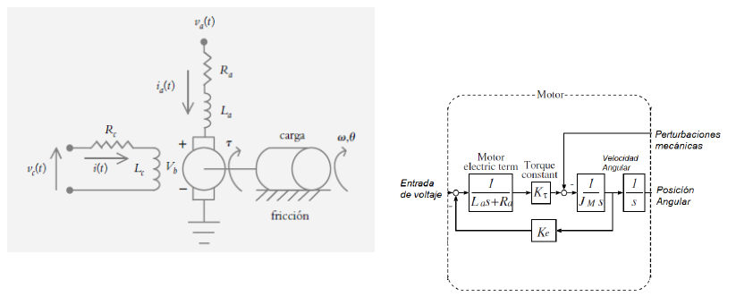
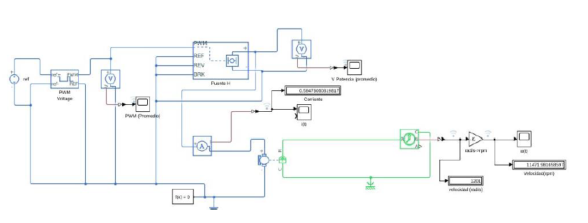
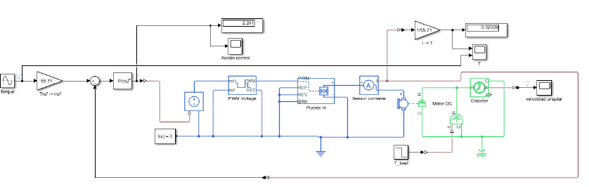

# Control de Movimiento

## Introducción
En esta clase se explicaron los sistemas de control de movimiento, enfocándose en servomotores y motores eléctricos. Explicando la importancia de los sistemas de control para regular la posición, velocidad y torque de un motor.

##Servomotor
Proviene de la palabra esclavo, y se refiere a la capacidad del sistema para seguir comandos de posición, velocidad o torque mediante un sistema de control. Tambien son conocidos como servomecanismos.

## Tipos de Motores
### Motores de Corriente Continua (DC)
- Descripción de su estructura: estator, rotor y colector de delgas.
- Aplicaciones en la industria.

### Motores de Corriente Alterna (AC)
#### Motores Síncronos
- Funcionamiento basado en la sincronización con la frecuencia de la red eléctrica.
- Aplicaciones industriales.

#### Motores Asíncronos
- Principio de inducción electromagnética.
- Aplicaciones industriales.

## Comparación de Motores
| Tipo de Motor | Ventajas | Desventajas |
|--------------|----------|------------|
| DC | Control simple, bajo costo, alta eficiencia en aplicaciones pequeñas | Requiere mantenimiento, imanes pueden desmagnetizarse |
| AC Síncrono | Alta eficiencia, poco mantenimiento | Control más complejo, requiere sincronización |
| AC Asíncrono | Robustos, excelente resistencia al entorno | Menor eficiencia en pequeñas aplicaciones |

## Modelado de Motor DC
💡**Ejemplo de modelo de motor DC:**

Figura 1. Modelo motor DC

## Sensores en Servomecanismos
### Encoders
Los encoders son dispositivos que convierten el movimiento mecánico en señales eléctricas para medir posición y velocidad de un motor. Existen dos tipos de encoders:

- **Absolutos**: Proporcionan una posición única y fija en cada revolución, lo que permite conocer la posición exacta sin necesidad de un punto de referencia. Son útiles en aplicaciones donde la posición debe ser conocida inmediatamente después de un reinicio.
- **Incrementales**: Generan pulsos por unidad de movimiento. Para determinar la posición, es necesario un punto de referencia inicial y contar los pulsos desde ese punto. Son más simples y económicos que los encoders absolutos, pero requieren un sistema adicional para mantener el seguimiento de la posición en caso de pérdida de energía.

### Resolver
Un resolver es un sensor analógico de posición angular que funciona de manera similar a un transformador. Se compone de un rotor y un estator, donde la variación de la posición relativa entre ellos genera una señal eléctrica proporcional al ángulo.

- Opera en un amplio rango de temperaturas y ambientes hostiles, lo que lo hace ideal para aplicaciones industriales severas.
- No sufre degradación con el tiempo como los encoders ópticos, lo que permite mayor durabilidad y menor mantenimiento.
- Requiere circuitos adicionales para convertir la señal analógica en digital y poder ser procesada por sistemas electrónicos modernos.

### Medición de Torque
El torque se infiere a partir de la corriente consumida por el motor, ya que existe una relación aproximadamente lineal entre ambos. Para medir la corriente, se emplean los siguientes métodos:

- **Shunt**: Se coloca una resistencia de muy bajo valor en serie con el motor y se mide la caída de tensión para calcular la corriente con la Ley de Ohm. Es un método simple y de bajo costo.
- **Sensor de efecto Hall**: Detecta los cambios en el campo magnético generado por la corriente que fluye en el motor, permitiendo una medición sin contacto. Son más precisos y no generan pérdidas, pero requieren mayor procesamiento de la señal.

## Drivers de Potencia
Los drivers de potencia son circuitos que amplifican señales de control para proporcionar la energía necesaria a los motores. Actúan como intermediarios entre un microcontrolador y el motor, permitiendo un control eficiente. 

- Uso de modulación por ancho de pulso **(PWM)** para variar la velocidad y el torque del motor.
- Implementación con **L293 y L298**, que son circuitos integrados diseñados para controlar motores de corriente continua y motores paso a paso.

## Simulacion
💡**Ejemplo de simulación de motor DC:**

Figura 2. Simulación motor DC

## Control de Torque y Conversión de Energía
- Métodos de control de torque en motores DC mediante PWM y retroalimentación de corriente para garantizar estabilidad y precisión en el control.
- Implementación de conversores reductores para ajustar la tensión aplicada al motor y mejorar la eficiencia energética, minimizando pérdidas en el sistema.
- Uso de inversores y modulación SPWM (Sinusoidal Pulse Width Modulation) para el control de motores de corriente alterna, mejorando la eficiencia y el rendimiento en sistemas de alta potencia.
- 💡**Ejemplo de control de torque de motor DC:**

Figura 3. Control torque motor DC

## Conclusión
El estudio de los sistemas de control de movimiento es fundamental para la implementación eficiente de motores eléctricos en diversas aplicaciones industriales y tecnológicas. La correcta elección entre motores de corriente continua y corriente alterna, junto con el uso adecuado de sensores y drivers de potencia, permite optimizar el rendimiento y la eficiencia de los sistemas de automatización. 

Las simulaciones y la validación experimental juegan un papel crucial en la optimización de los parámetros de control, asegurando que los modelos teóricos se ajusten a las condiciones reales de operación. Además, el uso de técnicas avanzadas como la modulación PWM y los inversores SPWM facilita la regulación de la velocidad y el torque, mejorando el desempeño general del sistema. 

## Bibliografía
- [1]CHAPMAN (2005). "Máquinas eléctricas". McGraw-Hill.
- [2]SERRANO IRIBARNEGARAY (1989). "Fundamentos de máquinas eléctricas rotativas". Marcombo.
- [3]“AulasVirtualesECCI: Entrar al sitio”, Edu.co. [En línea]. Disponible: https://aulas.ecci.edu.co/course/view.php?id=9304 .
